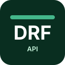

# Kevin Hernández

**Full-Stack Developer** 
Vue · TypeScript · Python · Django REST Framework · PostgreSQL

[English](README.md) | [Español](README.es.md)

---

## Professional Profile

Full-Stack Developer with around 2 years of experience building maintainable web applications, REST APIs and structured backend systems.

The main stack is focused on **Vue**, **TypeScript**, **Python**, **Django**, **Django REST Framework** and **PostgreSQL**, with attention to clean code, practical architecture and scalable data modelling.

Experience includes frontend development, backend design, API development, relational databases and Docker-based development environments.

## Personal Projects

- [Portfolio](https://kevin0018.github.io/portfolio)
- [wikiLoL](https://wiki-lol-k.vercel.app/)
- [Huellas](https://github.com/kevin0018/Huellas)
- [GitHub](https://github.com/kevin0018)

## Main Stack

### Frontend

  
  
  

### Backend

  
  
  
  

### Tools

  
  
  
  

## Practices & Architecture

- REST API design
- Database modelling with PostgreSQL
- Test-Driven Development
- SOLID principles
- Domain-Driven Design
- CQRS
- Clean Architecture
- Docker-based development environments

## Contact

- [LinkedIn](https://www.linkedin.com/in/kevin-hernandez-deras)
- [akevin.2215@gmail.com](mailto:akevin.2215@gmail.com)

## CV

[Download CV](https://github.com/user-attachments/files/22214670/CV_Kevin_Hernandez_Deras.pdf)

---

## Thank you for visiting my profile

> Veni, vidi, vici.

